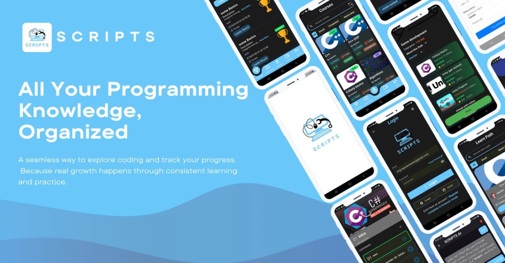

# Scripts – Programming Learning Management System

**Learning Management System (LMS)**

Scripts is a programming learning platform that aims to gather all programming knowledge in one easy-to-access,
organized environment. The platform encourages competition through completion certificates, achievements, contests and
more.

---

## 📱 Links

- **Flutter Mobile Application repo :** [Mobile Repo](https://github.com/tayseergit/Flutter_LMS)
- **Backend repo (Laravel):** [Backend Repo](https://github.com/ABDALRZAQ345/LMS)

---

## 💡  Features

### 1️⃣ Mobile App

#### Student

- **Authentication & Security:**
    - Login via Email (with verification code), Google, or GitHub.
    - Guest access to browse courses, paths, teachers, and students.
- **Profile:**
    - Display student information, points, balance, streaks, and activity status.
    - Show achievements, certificates, and contest participation.
- **Friends:**
    - Browse and add friends.
    - Search for specific users.
- **Competitions:**
    - View past, ongoing, and upcoming competitions.
    - Participate in competitions to earn points.
    - Leaderboard with option to filter by friends only.
- **Courses:**
    - List of courses with filters: Enrolled, Completed, Watch Later.
    - Rate courses and view previous ratings.
    - Instructor overview.
    - Free and paid courses; preview available lessons.
    - Progress tracking and quizzes between lessons.
    - Final exam for certificates upon completion.
- **Learning Paths:**
    - Browse and filter learning paths.
    - View courses within each path.
    - Instructor overview for each path.
- **Featured Projects:**
    - Browse student projects by type: web, mobile, game, etc.
    - Search for projects or view personal projects.
    - Submit projects for instructor approval.
- **Settings:**
    - Language: English/Arabic.
    - Dark/Light mode.
    - Password reset with verification code.
    - Top-up balance via Stripe.
    - Push notifications via Firebase.
    - AI Agent to assist students with course or contest suggestions and more (created by n8n).

---

### 2️⃣ Web Dashboard

#### Teacher

- Profile view.
- Manage learning paths and courses.
- Add/Edit/Delete videos and quizzes.
- Reorder course content.
- Add competitions.
- Approve or reject student projects.
- more.

#### Admin

- Full platform statistics.
- Manage users (students and teachers).
- Block users and restrict comments.
- Approve/Reject/Delete courses, learning paths, and competitions.
- Refund students when paid courses are deleted.
- more.

---

## 🛠️ Technologies Used

- **Back-end:** Laravel (PHP)
- **Mobile Front-end:** Flutter
- **Web Front-end:** React (next js)
- **Payment:** Stripe
- **Notifications:** Firebase Cloud Messaging (FCM)
- **AI Agent:** Custom AI for course suggestions and assistance by n8n and gemini model
- **Database:** MySQL
- **Authentication:** Email, Google, GitHub, Guest (jwt token)

---

## 🚀 Installation & Setup (backend)


1. **Clone the Project**
    ```bash
    git clone https://github.com/ABDALRZAQ345/LMS
    cd LMS
    ```

2. **Install Dependencies**
    ```
    composer install
    ```

3. **Environment Configuration**

- Copy the .env file:
    ```
     cp .env.example .env
    ```

- Configure the following in .env:

- Database settings.
- JWT secret:
       ```
       php artisan jwt:secret
       ```
  - Firebase credentials: place your firebase_credentials.json file at:
  ``
  storage/app/firebase/firebase_credentials.json
  ``

    And add to .env:
        ```
        FIREBASE_CREDENTIALS=storage/app/firebase/firebase_credentials.json
        ```

- Email settings (SMTP / Mailtrap / etc.).

- Google OAuth credentials:
    ```
    GOOGLE_CLIENT_ID=your_google_client_id
    GOOGLE_CLIENT_ID_MOBILE=your_mobile_client_id
    ```

- GitHub OAuth credentials:
    ```
    GITHUB_CLIENT_ID=your_github_client_id
    GITHUB_CLIENT_SECRET=your_github_client_secret
    GITHUB_REDIRECT_URI=http://localhost:8000/api/auth/github/callback
    ``` 
  

4. **Run Migrations & Seed Database**
    ```
    php artisan migrate --seed
    ```
5. **Run the Server**
    ```
    php artisan serve       # Start Laravel server
    php artisan queue:work   # Run background jobs
    php artisan schedule:work # Run scheduled tasks
    ```
---

## 👨‍💻 Team Members

- **Back-end (Laravel):**
    - Abd Alrzaq Najib .
    - Abd Alrahim Sarhan .
- **Mobile Front-end (Flutter):**
    - Taysir Matar .
    - Bara’ Al-Khatib .
- **Web Front-end (React):**
    - Bilal Khubayeh .

---
